# FamilyHub Platform - Solution Architecture

## High-Level System Architecture

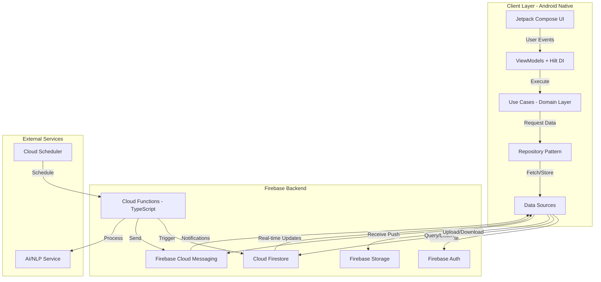

## Detailed Architecture - MVVM with Clean Architecture

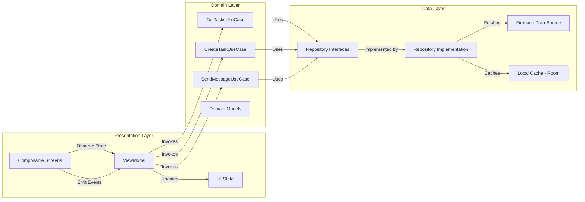

## Data Flow - Unidirectional Data Flow (UDF)

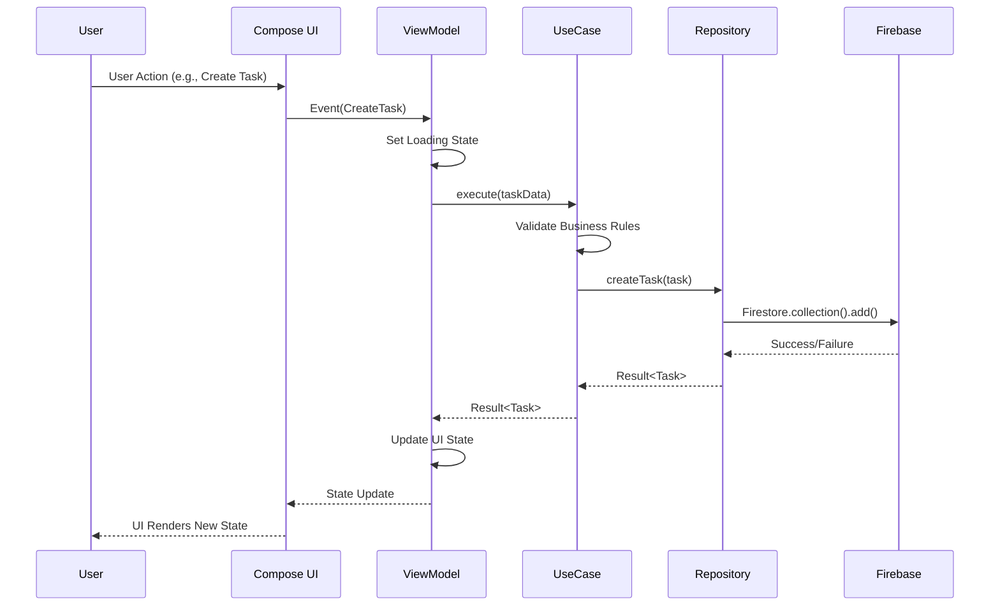

## Firebase Backend Architecture

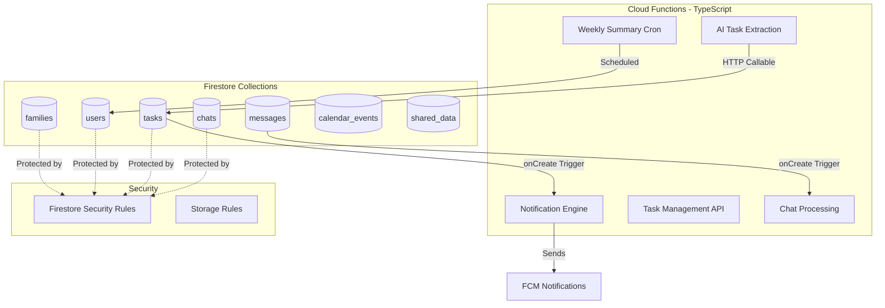

## Feature Module Architecture

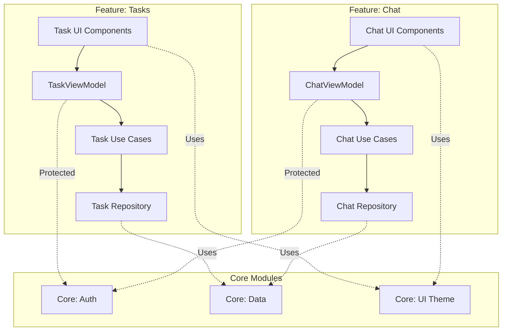

## Authentication & Authorization Flow

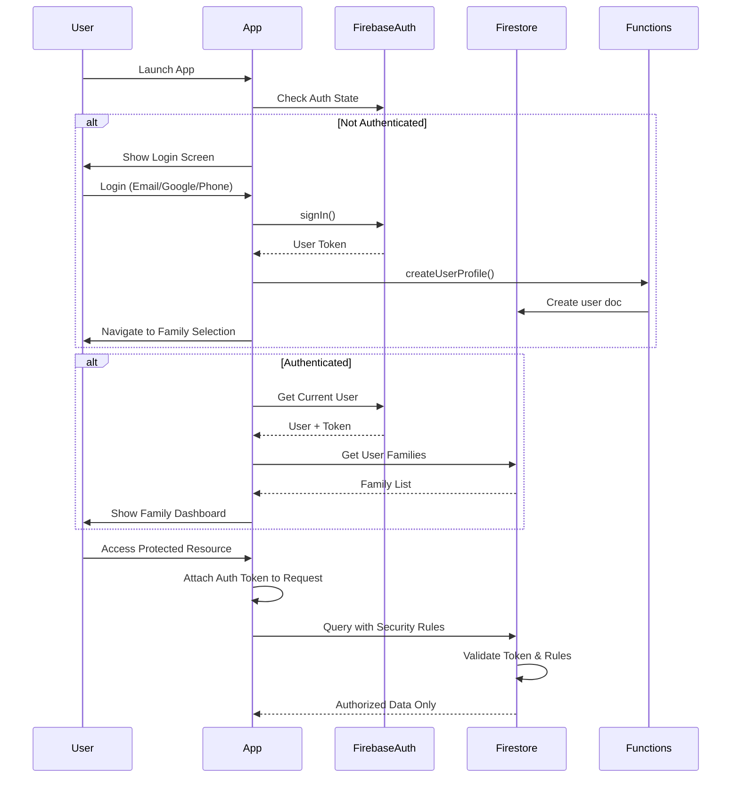

## Multi-Family Isolation Model

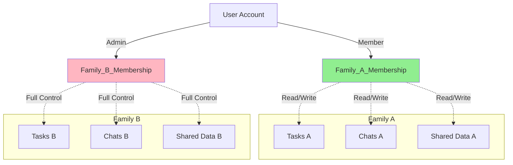

## Real-Time Data Synchronization

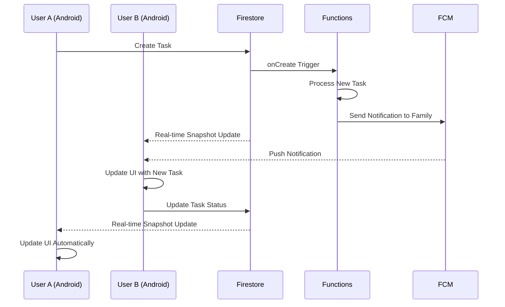

## AI Integration Architecture

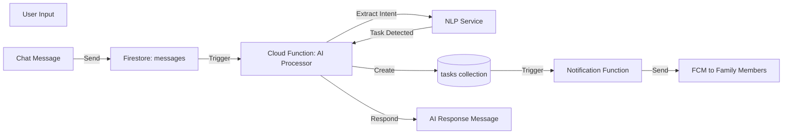

## CI/CD Pipeline Architecture

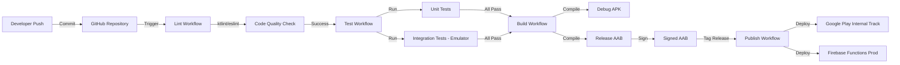

## Security Model

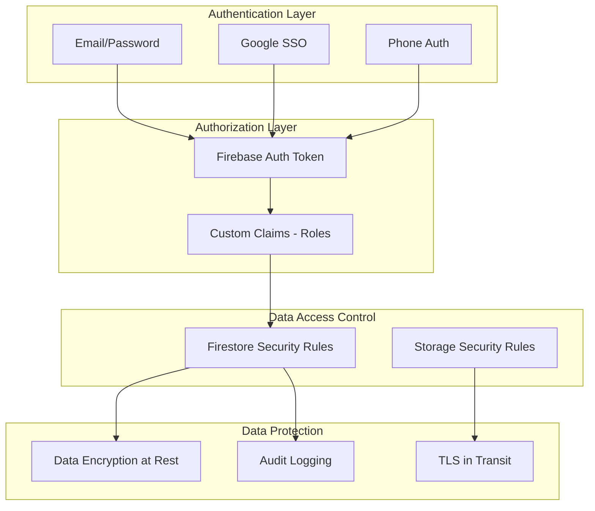

## Key Architectural Decisions

### 1. MVVM over MVI
- **Rationale**: Better separation, less boilerplate, native support
- **Trade-off**: Slightly less predictable than MVI for complex state
- **Mitigation**: Strict UDF patterns + immutable state

### 2. Firebase over Custom Backend
- **Rationale**: Real-time sync, offline support, built-in auth, scalability
- **Trade-off**: Vendor lock-in, limited complex queries
- **Mitigation**: Repository pattern abstracts Firebase, easy migration path

### 3. Modular Architecture
- **Rationale**: Parallel development, faster builds, clear boundaries
- **Trade-off**: Initial setup complexity
- **Benefits**: Testability, reusability, maintainability

### 4. TypeScript for Cloud Functions
- **Rationale**: Type safety, better tooling, prevents runtime errors
- **Requirement**: MANDATORY per project spec

### 5. Hilt for DI
- **Rationale**: Official Android DI, compile-time validation, scoping
- **Alternative Considered**: Koin (runtime DI)
- **Winner**: Hilt (type safety + performance)

## Performance Considerations

1. **Firestore Query Optimization**
   - Composite indexes for complex queries
   - Pagination for large datasets
   - Denormalization where appropriate

2. **Image Loading**
   - Coil library for Compose
   - Firebase Storage URLs with caching
   - Thumbnail generation in Cloud Functions

3. **Offline Support**
   - Firestore offline persistence enabled
   - Local caching for critical data
   - Optimistic UI updates

4. **Build Performance**
   - Modular architecture enables parallel builds
   - Gradle build cache enabled
   - Configuration cache enabled
